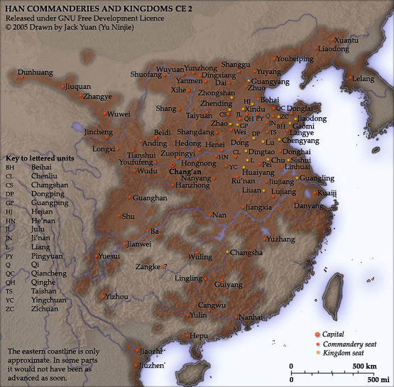

# 03 阶段二·柳城时代

文字记载一进入这片地方，它就不再是无主之地。战国燕向东北经略，设五郡、修长城，秦汉沿用并调整；与此同时，东胡、乌桓、鲜卑在不同时期活跃于同一片区域。边疆不是一道静止的线，而是人口迁徙、军事行动、互市与结盟反复发生的地带。这一阶段的终点是 207 年的白狼山之战——它打散了三郡乌桓的独立政治力量，也让鲜卑走上舞台中央，为下一个阶段的龙城准备了空间。

* **前 300 前后** 秦开却胡
* **燕五郡** 上谷 · 渔阳 · 右北平 · 辽西 · 辽东
* **前 2 世纪** 乌桓内迁
* **207** 白狼山之战
* **238** 司马懿灭公孙渊

## 2.1 白狼水：大凌河的名字演变

_时期：先秦 — 明清_

走进文字记载中的辽西，第一条线索是水。今天的大凌河，在《水经注》里叫**白狼水**；唐代诗文里作**白狼河**；辽金元时期又有**灵河、凌河、凌水、凌江**等写法；明代以后“大凌河”逐渐固定，用来与小凌河相区别。

名字变来变去，本身就是一条线索——\*\*“灵”与“凌”的递变、“白狼”与“凌”的替换，恰好记录了这一带在不同政权下被反复命名、反复重新认识的过程。\*\*每一次改名，背后都是一次归属的更替。

| 时期    | 常见名称        |
| ----- | ----------- |
| 早期文献  | 渝水、龙川等      |
| 北魏    | 白狼水         |
| 唐代    | 白狼河         |
| 辽 — 元 | 灵河、凌河、凌水、凌江 |
| 明代以后  | 大凌河         |

今天的大凌河。河谷阶地适合聚落，河道又提供了连接上下游的天然通道——柳城、龙城、营州、兴中府之所以反复出现在这一线，前提就是这条河 · 摄影：[Wikimedia Commons](https://commons.wikimedia.org/wiki/File:%E5%A4%A7%E5%87%8C%E6%B2%B3%EF%BC%8C2023%E5%B9%B48%E6%9C%8821%E6%97%A5_02.jpg)


**概念辨析｜“白狼水、白狼山、白狼县、白狼城”不是同一个地方。**

“白狼水”主要对应今天的大凌河；“白狼山”是沿河古地理中的山名，并与 207 年的战争叙事相关；“白狼县”是汉代县名；“白狼城”则与古县治或城址相关。四个名称共享“白狼”二字、彼此关联，却分别指河流、山、县和城，不是同一种地理实体。


## 2.2 秦开却胡：燕的东北五郡与燕北长城

_时期：战国中晚期_

商周至春秋，燕国北部与山戎等群体长期接触。到了战国，**东胡**成为燕国东北方向更重要的力量。

转折点是一位将军。燕将**秦开**曾在东胡为质，熟悉其内部情况；归燕后率军击退东胡。燕国随后在北方与东北方向设置**上谷、渔阳、右北平、辽西、辽东五郡**，并修筑自造阳至襄平的燕北长城。大、小凌河流域由此更深入地纳入郡县、障塞和交通体系。

长城在这里不只是“一堵墙”。它是一整套设施：墙体、城障、烽燧、驻军点和连接它们的道路网络。它既承担防御功能，也保护新设的郡县与迁入的人口。建平等地保存的燕秦长城遗迹，就是大凌河上游从青铜时代文化区转向帝国边郡的地面证据。

公元 2 年的汉朝郡国。注意东北沿边的辽西、右北平、渔阳、上谷等郡——燕国所设的五郡被秦汉沿袭，辽西郡正跨在今天的辽宁与内蒙古之间 · 图：[Wikimedia Commons](https://commons.wikimedia.org/wiki/File:Han_commanderies_and_kingdoms_CE_2.jpg)（Jack Yuan 绘，GNU FDL）


**概念辨析｜燕长城不是今天熟悉的明长城。**

战国燕长城多以夯土、石砌墙体和障塞构成，保存形态与明代的砖石长城很不一样。经过两千多年侵蚀，一些遗迹看起来只是山脊上的土垄或石线，必须结合考古调查判断——不能把所有“老墙”都认作长城，也不能因为看不见砖石就否认它的存在。


## 2.3 汉朝经略、乌桓内迁与公孙氏辽东

_时期：前 2 世纪 — 3 世纪_

东胡联盟被匈奴击破后，文献中的**乌桓、鲜卑**逐渐活跃。汉武帝时期，朝廷把部分乌桓安置在上谷、渔阳、右北平、辽西、辽东等边郡地带，希望他们侦察匈奴动向并协助守边。这种安排从一开始就带有两面性：乌桓首领受封、参与互市、随军作战，同时也反复反叛——**归附与冲突交替，是边疆关系的常态，而不是某一次政策失误的结果。**

到东汉末年，中央权威衰落，辽西一带的地方力量重新组合。袁绍集团曾与乌桓结盟；袁绍死后，袁尚、袁熙在河北失势，转而向乌桓寻求支持。辽西**柳城**附近因此成为三郡乌桓政治活动的重要节点，也成为袁氏残余与曹操争夺的战略空间。

与此同时，**公孙度**及其后继者以辽东为根据地扩张。这个政权的核心在辽河以东，却直接影响柳城的战略位置：它经营郡县，向朝鲜半岛北部发展，并借婚姻与军事手段在扶余、高句丽、鲜卑之间维持平衡。238 年司马懿攻灭公孙渊之后，曹魏更直接地面对东北诸力量——**柳城由此成为观察中原政权、草原部落与辽东割据三方关系的窗口。**

讨论“朝阳在汉代的位置”，应当理解为它处在这一边郡网络之中，**而不宜把后世的城市边界机械地套回古代**。汉代辽西郡的辖境与今天的朝阳市并不重合，两者的范围各有出入。

## 2.4 207 年白狼山之战

_时期：建安十二年_

建安十二年（207），曹操采纳郭嘉等人的战略意见北征乌桓。大军经险道出塞，在**白狼山**附近与以**蹋顿**为核心的乌桓力量决战。战后蹋顿被斩，袁尚、袁熙继续逃往辽东，最终被公孙康所杀。

这场战争削弱了三郡乌桓的独立政治力量。大批乌桓人口被迁徙、整编，逐渐融入中原社会；乌桓衰落后，同样源出东胡历史谱系的**鲜卑诸部**在辽西及其北部更趋活跃，为三世纪以后慕容鲜卑的崛起创造了条件。

| 角色    | 位置与行动          | 结果            |
| ----- | -------------- | ------------- |
| 曹操    | 北征统帅；绕道进军，争取先机 | 稳定北方后方        |
| 郭嘉    | 主张乘乌桓未备迅速远征    | 战略建议被采纳，归途中病逝 |
| 蹋顿    | 乌桓首领；支持袁氏残余    | 白狼山战败被斩       |
| 袁尚、袁熙 | 失去河北后依附乌桓      | 逃往辽东后被杀       |
| 公孙康   | 辽东地方势力         | 杀袁氏兄弟并送首级     |


**概念辨析｜古战场很难精确到一点。**

古代史书常以山、水、城或行军日程来定位战事，但河道会改迁、地名会移动，同名地点也可能并存。考证白狼山之战，需要把文献里程、河谷走向、古城遗址与地形通道综合起来看。**“大致区域可信”不等于“某一块石头就是交战中心”**——白狼山的具体地望至今仍有不同说法。



**力量格局——柳城与四方**

向西是曹魏控制的幽州与中原；向北是乌桓衰落后不断壮大的鲜卑诸部；向东是公孙氏经营的辽东与正在扩张的高句丽；更远的东北有扶余。柳城恰在这些方向的交会处。

这种关系不能画成一条简单的统属线。公孙氏可能向曹魏称臣，同时保持高度自主；扶余既接受中原王朝印绶，也会借辽东力量牵制高句丽；鲜卑各部随局势结盟、归附或交战。**所谓“边疆秩序”，实际是多重关系不断重新协商的结果。**



**概念辨析｜东胡、乌桓、鲜卑不是简单的接力。**

传统叙述常把东胡被匈奴击破、乌桓衰落、鲜卑兴起写成整齐的先后接替。现实更复杂：不同部众可能迁徙、分化、重新结盟，也可能吸收汉地、匈奴及其他人群。族名的变化既包含历史渊源，也反映政治组织的重新形成。


因此，白狼山之战之后的朝阳史不能只写“曹操胜利”。真正影响深远的是辽西力量重新组合，并为慕容鲜卑进入辽西、建立三燕政权准备了政治空间——这就是下一个阶段。
