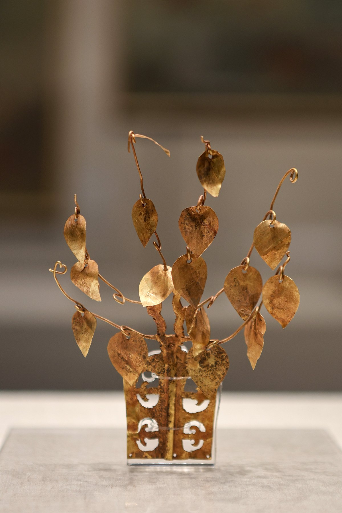
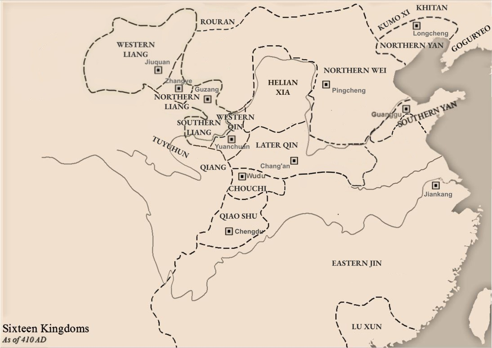
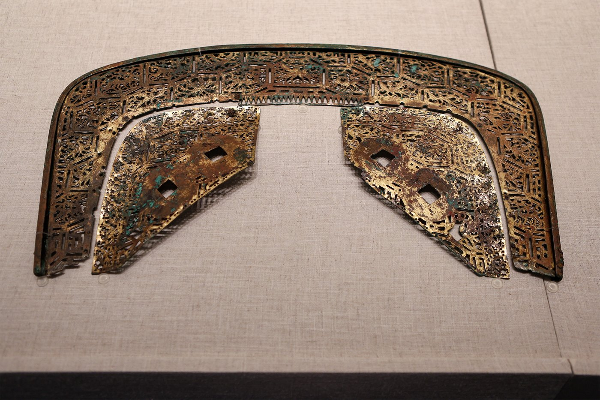
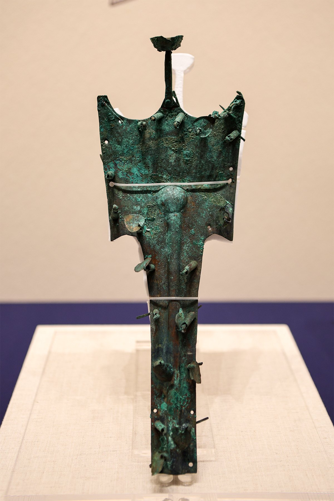

# 04 阶段三·龙城时代

这是朝阳唯一一段“自己就是中心”的历史。四世纪之交，慕容鲜卑在辽西积累力量；341 年在柳城以北、龙山以西营建龙城，次年迁都于此。此后前燕、后燕、北燕先后以龙城为都城或政治根基，直到 436 年北魏攻取。草原的军事组织、中原的官制礼法与辽东的交通网络，在同一座城里合成了一种新的区域文化——它既是都城，也是一个多族群社会。

* **294 前后** 慕容廆经营辽西
* **337** 慕容皝建前燕
* **341 / 342** 营建龙城 · 迁都
* **407** 北燕以龙城为根基
* **436** 北魏取龙城

## 3.1 从柳城到龙城：慕容鲜卑的半个世纪

_时期：294 — 342_

294 年前后，**慕容廆**在辽西一带经营势力。他面对的局势很具体：西晋末年以来中原战乱，大量人口北出；辽西处在中原、草原与辽东之间，谁控制了交通，谁就能同时得到人口、粮食和情报。慕容政权开始吸纳汉族士人，沿用中原的官制与礼法，同时保留鲜卑的军事组织和政治传统。

337 年**慕容皝**建立前燕；341 年在柳城以北、龙山以西营建新都，342 年迁都于此——**龙城**由此出现。宫殿、官署、道路、市场和宗教空间一起形成，一块区域性的交通枢纽，就这样被改造成王朝的政治核心。

朝阳出土的前燕文物，可以直接看出这种社会的两面。**金步摇**一类的贵族头饰属于礼制与身份的表达，讲究的是装饰工艺与等级的对应；而**鎏金铜马具**属于军事与交通，讲究的是实用与强度的兼顾。同一个人群，同时在做这两件事。

前燕金步摇（朝阳市博物馆藏）。步摇随行走而摇动，是北方族群贵族身份的标志性饰物；这类器物的形制既见于辽西，也见于更北的草原地带 · 摄影：[Windmemories](https://commons.wikimedia.org/wiki/File:20260820_Gold_Buyao.jpg) · [CC BY-SA 4.0](https://creativecommons.org/licenses/by-sa/4.0/)


\*\*概念辨析｜“汉化”不是单向替代。\*\*慕容政权用了中原的官制、礼法和文字，也说鲜卑的话、保留部落化的军队编制。把这段历史写成“鲜卑人被汉人同化”，会漏掉另一半：中原的移民也在适应辽西的生活，服饰、饮食、婚姻和军事组织都在互相改变。**文化的相遇从来是双向的。**


## 3.2 前燕、后燕、北燕：三燕都城

_时期：337 — 436_

前燕后来迁都中原，但龙城始终是慕容政权的重要根基。慕容垂建立**后燕**后，龙城在政权后期再次成为都城；冯跋建立**北燕**，也以龙城为中心。436 年北魏攻取龙城，三燕都城时代结束。三朝合计约百年，**但“三燕”不是三个连续的王朝，而是同一片地盘上先后建立的三个政权**，彼此之间还有战争与继承关系。

把龙城放回当时的地图上看，它处在几股力量的夹缝里：西与西南是北魏与后秦，北面是柔然与库莫奚、契丹等草原诸部，东面是高句丽，再往东北是扶余。它既是都城的中心，也是这些方向彼此角力的交点。

公元 410 年的十六国形势。图中东北部标出的 \*\*Longcheng（龙城）\*\*即为今朝阳，当时是北燕的都城；其北为柔然（Rouran），东北是契丹（Khitan）与库莫奚（Kumo Xi），东面为高句丽（Goguryeo）——这正是龙城所处的三面环境 · 图：[Wikimedia Commons](https://commons.wikimedia.org/wiki/File:Sixteen_Kingdoms_410_AD.jpg)


**小结｜都城史的核心是什么。不是“存在过一个固定王朝”，而是同一片城市空间被不同政权反复占据、焚毁、重建和重新赋义**。北塔之下的地层，就是这段历史最直观的剖面——三燕的宫殿夯土之上，压着北魏的佛图、隋代的舍利塔和辽代的砖塔。


## 3.3 移民与制度：辽西文化圈的形成

_时期：4 世纪_

西晋末年以来，中原战乱使大量人口进入辽西。这些人里有士人、工匠、僧侣，也有普通农户和兵士。慕容政权把中原的官制、律令和礼法搬过来，用它们管理一个以鲜卑军事组织为骨架的社会；同时，辽西本地和辽东、草原的各色人群也在被编入同一套体系。

结果不是谁取代了谁，而是一个兼具草原、辽东和中原因素的**区域文化圈**。朝阳出土的墓葬、壁画、陶器与建筑遗存，既能看到中原制度和审美的影响，也保留着北方族群的生活与军事传统。同一座墓里，随葬品可能同时属于两种不同的文化逻辑。

前燕鎏金铜马具饰件（朝阳市博物馆藏）。马具是慕容鲜卑军事传统的直接物证：骑乘与作战能力决定了这个政权能在辽西站住脚，也因此成为随葬品中格外讲究的一类 · 摄影：[Windmemories](https://commons.wikimedia.org/wiki/File:20260820_Gilded_Bronze_Harness_Ornament_04.jpg) · [CC BY-SA 4.0](https://creativecommons.org/licenses/by-sa/4.0/)

前燕鎏金铜当卢（马面饰，朝阳市博物馆藏）。当卢是佩戴在马额正中的装饰，既有保护作用，也是区分骑乘者身份的部件之一 · 摄影：[Windmemories](https://commons.wikimedia.org/wiki/File:20260820_Gilded_Bronze_Danglu_01.jpg) · [CC BY-SA 4.0](https://creativecommons.org/licenses/by-sa/4.0/)


\*\*概念辨析｜“鲜卑化”不是文化倒退。\*\*有些叙述把北方政权的草原传统视为“落后”，把采纳中原制度视为“进步”。但在四世纪的辽西，军事组织、部落认同和骑射技术恰恰是政权能够在多方夹击中生存的条件。制度选择是生存策略，不是文明等级的升降。


## 3.4 龙城的外部世界：高句丽、扶余与佛教交通

_时期：4 — 5 世纪_

三燕与**高句丽**之间既有战争，也有外交、婚姻、人口流动和文化接触。辽东局势的每一次变化，都会影响龙城的安全与资源；北燕末年，末代君主**冯弘**东奔高句丽，更说明两地政治命运彼此牵动。**扶余**的中心大体位于今吉林中部的松花江流域，魏晋时期它既要应对高句丽的扩张，也与辽东郡、公孙氏、曹魏以及后来的前燕保持朝贡、结盟或依附关系。前燕慕容皝曾东击高句丽，后又进攻扶余并掳其王——**要取得辽东优势，就必须同时处理辽河以东与松花江流域的力量。**

| 力量      | 大体核心区域       | 与朝阳 / 龙城的关系                |
| ------- | ------------ | -------------------------- |
| 公孙氏辽东政权 | 辽东郡及朝鲜半岛北部   | 控制柳城以东的门户；与乌桓、鲜卑、高句丽、扶余周旋。 |
| 扶余      | 今吉林中部、松花江流域  | 经辽东、公孙氏与三燕进入朝阳视野；曾与高句丽竞争。  |
| 高句丽     | 鸭绿江中游，后扩展至辽东 | 与三燕战和反复；北燕冯弘最终东奔高句丽。       |

这张图谱表达的是**关系网络**，不是固定的疆界图。古代文献中的族名、国名与现代民族、现代行政区域并非一一对应。

龙城还连接着一个更远的网络：佛教。**凤凰山**古称龙山，前燕时期修建的龙翔佛寺，被地方历史叙事视为东北较早见于记载的佛寺之一。北燕僧人**昙无竭**（又名法勇）相传从龙城一带出发，经西域前往印度求法，时代早于玄奘二百余年——“三燕龙城既接近东北边地，也连接着横跨欧亚的佛教传播路线。”


\*\*人物故事｜从北燕公主后裔到北魏太后。\*\*冯太后是北燕末代君主冯弘的孙女、冯朗之女。北燕灭亡后，冯氏家族进入北魏；她后来成为北魏文成帝皇后，又以皇太后、太皇太后身份两度临朝。约 485 至 490 年间，她在龙城旧宫基址上兴建“思燕佛图”——塔名里的“思燕”，把她的北燕血缘、对父祖的追念与北魏皇家的佛教功德连在了一起。**一座塔同时装着家族记忆和王朝政治。**


436 年北魏攻取龙城后，部分官民被迁往平城等地，部分人口留在辽西，另一些进入辽东或高句丽控制区。\*\*古都衰落并不意味着居民全部消失，而是政治中心、人口和技术发生了再分配。\*\*北魏、北齐、北周和隋唐继续利用旧城的交通条件，并在宫殿基址上营建佛塔；三燕时期汇聚的工匠传统、佛教信仰和多族群社会，因此以新的制度形式延续下去——下一篇的“营州”，正是都城遗产向区域门户转型的结果。
