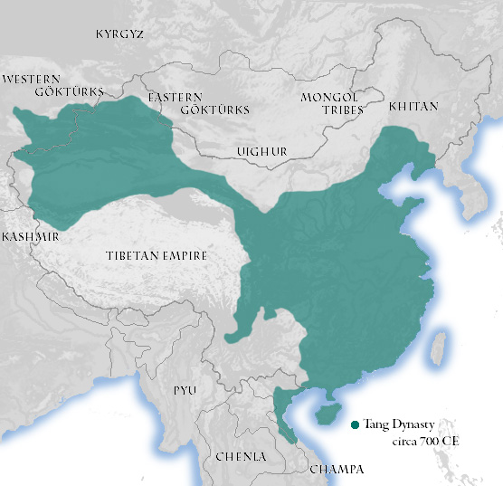
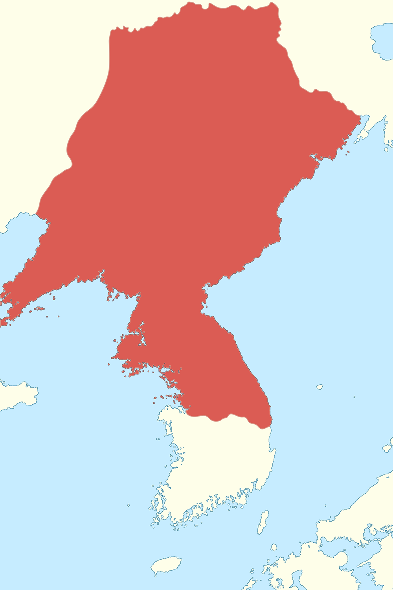

# 05 阶段四·营州门户

龙城不再是都城，却因为这个位置变得更忙。北魏在旧宫基址上营建佛图，此后北齐、北周、隋唐相继控制辽西；唐代以柳城为营州治所，使这里成为经营东北的军政重镇——平卢节度使驻此，羁縻都督府分别联系契丹与奚，互市上流通马匹、牲畜和布帛，也流动语言、服饰与信仰。696 年的一场起兵，让这里成为帝国东北体系的裂缝，也间接催生了渤海国。

* **436 — 602** 北魏佛图 · 隋代舍利塔
* **唐** 营州 · 平卢节度使
* **羁縻** 松漠府（契丹） · 饶乐府（奚）
* **668** 唐灭高句丽
* **696** 营州事件
* **698 前后** 震国 / 渤海

## 4.1 北朝：从王朝首都到区域治所

_时期：436 — 6 世纪_

北魏取得龙城后，在旧宫殿基址上营建了思燕佛图。此后北齐、北周相继控制辽西，区域建置随政权更替而调整。\*\*龙城由王朝首都转为区域治所，却继续利用旧有的道路、城址和人口基础。\*\*一座城市的“降级”，往往不意味着废弃——只要交通条件还在，它就会以别的名义继续被使用。

北朝时期，战争中的降附人口、军户，以及来自鲜卑、高句丽等不同背景的人群被安置在营州及周边。这里既是军事前沿，也是人口重新编组、文化重新磨合的集散地。隋代在这里的舍利塔建设，又把城市的佛教传统延续进了统一王朝。


\*\*概念辨析｜判断一座城市是否“延续”，不能只看名字。\*\*从龙城到营州，名称变了、级别变了、统治者变了。要判断城市本身有没有延续，得看更实在的东西：道路走向、建筑方位、墓地位置、陶器和生活垃圾的层位是否连续。朝阳北塔及三燕龙城遗址之下多时期叠压的地层，提供的正是这种证据。


## 4.2 唐代营州：军镇、互市与羁縻

_时期：7 — 8 世纪_

唐代以柳城为**营州**治所，使其成为经营东北的军事与交通重镇。唐玄宗时期，**平卢节度使**驻营州，统辖边军并应对契丹、奚等力量；**松漠都督府、饶乐都督府**等羁縻机构，则分别联系契丹、奚的首领。


\*\*概念辨析｜什么是“羁縻”。\*\*羁縻不是今天意义上的直接县级行政。朝廷授予当地首领官职、印绶，通过册封、贡赐和联姻维持关系，由首领自己管理部众；朝廷一般不派流官、不编户籍。**控制是间接的，代价低，稳定性也低**——一旦首领与边将关系破裂，整片区域可能同时失控。这正解释了 696 年发生的事。


营州汇集了汉人、契丹、奚、高句丽遗民、靺鞨、突厥以及来自中亚的商旅。互市既交换马匹、牲畜、布帛和金属器，也让语言、服饰与信仰彼此影响。安禄山早年活动于营州边地市场，史籍称其善多种语言、曾任**互市牙郎**；关于其具体族属与家世，史料解释并不完全一致。


**概念辨析｜“互市牙郎”是什么。**“互市”是边地官方或半官方的贸易，“牙郎”相当于熟悉行情、语言和交易规则的中介人，帮买卖双方议价、翻译并撮合交易。营州多族群并居，能掌握多种语言的人既可能成为商贸中介，也容易顺势进入军政网络——安禄山就是从这个位置起步的。


公元 700 年前后的唐帝国。绿色为唐控制区：营州正在其东北边缘，紧邻标注为 KHITAN（契丹）的部族区——帝国的“东北门户”，说的就是这条边界上的位置 · 图：[Wikimedia Commons](https://commons.wikimedia.org/wiki/File:Tang_Dynasty_circa_700_CE.jpg)

## 4.3 高句丽灭亡与 696 年营州事件

_时期：668 — 698_

668 年，唐与新罗联军灭高句丽，大量人口迁徙，东北政治空间重新组合。营州成为安置、管理和调动人口的重要节点。高句丽遗民并非单一行动整体——不同首领与集团会在唐朝、契丹、新罗及新兴地方力量之间作出不同选择。

696 年，契丹首领**李尽忠、孙万荣**在营州起兵。传统叙事把导火索与营州都督**赵文翙**对契丹首领的轻慢、灾荒处置失当联系起来；更深层的原因则包括羁縻关系失衡、地方治理矛盾和契丹自身力量的成长。李尽忠称“无上可汗”，孙万荣继续扩大战事，局势波及河北与东北交通。武周多次调兵，并利用突厥等周边力量夹击契丹。

事件最终被平定，却改变了地区力量配置：营州人口离散、道路受阻，部分高句丽遗民和靺鞨集团东迁。**大祚荣**在复杂的迁徙与战争中逐渐整合力量，于 698 年前后建立政权，后来发展为**渤海国**。

| 阶段   | 人物 / 群体     | 关系与走向              |
| ---- | ----------- | ------------------ |
| 营州起兵 | 李尽忠、孙万荣     | 反唐起兵，契丹力量迅速扩大。     |
| 唐廷应对 | 武周朝廷与边军     | 多路征讨，联合突厥等力量夹击。    |
| 人口迁徙 | 高句丽遗民、靺鞨集团等 | 在战乱中东迁，寻求新的生存空间。   |
| 政权形成 | 大祚荣集团       | 东迁后整合多方人群，形成震国／渤海。 |

公元 476 年前后的高句丽（红色）。鸭绿江中游是其核心，后向西扩展到辽东——这片区域与辽西的营州长期互为攻守对象，也解释了为什么唐代东北的每一次重组都绕不开它 · 图：[Wikimedia Commons](https://commons.wikimedia.org/wiki/File:Map_of_Goguryeo_\(476\).png)


\*\*人物故事｜一对姻亲掀起边疆风暴。\*\*李尽忠与孙万荣不仅是契丹首领，也是姻亲。李尽忠起兵后不久去世，孙万荣接续统军，使冲突从营州迅速扩大。**个人关系并非事件的根本原因，却解释了权力为什么能在危急时刻迅速交接。**



\*\*概念辨析｜不要把它归为单一原因。\*\*营州事件与渤海国的建立之间存在重要的历史联系，但不能简化成一条单因果链。战乱、迁徙、唐朝东北政策、契丹自身的变化以及遗民集团的组织能力共同作用，才形成新的政治格局。


## 4.4 两条道路：安禄山与李光弼

_时期：8 世纪_

唐代的东北边军，为不同出身的人提供了上升通道。两件事最能说明这座边城的性质：**安禄山**从营州互市与边军环境进入帝国权力中心，后来发动了安史之乱；**李光弼**则出身营州柳城的契丹家庭，成为平定安史之乱的重要将领。

同一座边城，能产生走向完全不同的人生。这说明营州不是文化的边缘，而是唐帝国军事与人才网络的一部分。**阅读这类人物时，要把个人族属、家庭背景与政治选择分开**：多族群的出身并不预先决定忠诚或叛乱；真正塑造行动的，还有边军制度、权力竞争与个人处境。


\*\*小结｜营州为什么重要。\*\*它的重要性来自“门”的位置：向西可联系幽州和中原，向东通辽东，向北连接契丹、奚等活动区域。\*\*门户既能聚集贸易、人口和信息，也最容易在帝国控制减弱时成为冲突中心。\*\*696 年的震荡正说明，交通枢纽与政治风险往往是一体两面。

