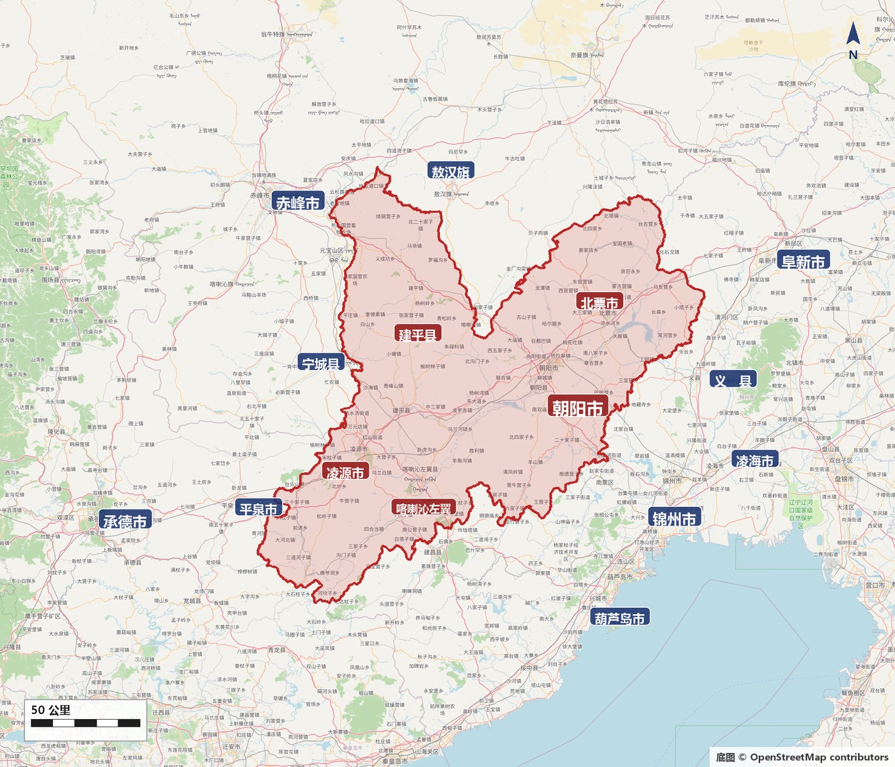
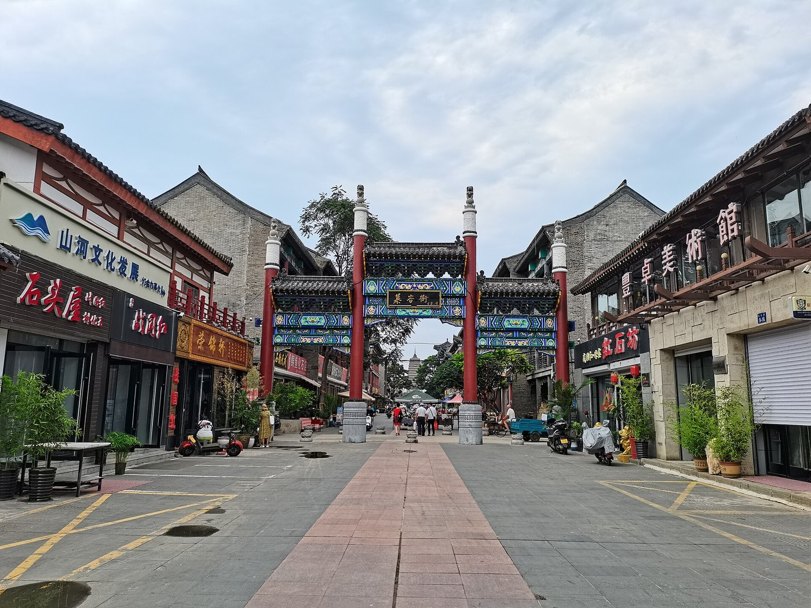

# 01 序·河谷地理

讲归属之前，先讲舞台。朝阳的全部故事都发生在大凌河谷：上游在凌源、喀左，中游经过朝阳、北票，下游流向义县、凌海与辽东湾。这条河谷向西经燕山山口通中原，向北接草原，向东出辽东——它同时是化石的保存地、文化的交汇区和东北交通的节点。而“朝阳”这个名字，要等到清代才稳定下来。

* **大凌河** 古称白狼水
* **辽西走廊** 中原—东北通道
* **三座塔** 旧城地名
* **1774** 置三座塔厅
* **1778** 设朝阳县

## 0.1 一条河，三个方向

_时期：地理_

大凌河并不只是地图上的一条蓝线，而是一整套由主流、支流、河谷盆地、冲积平原和山口组成的生活空间。**上游**在凌源、喀左一带，河谷窄、山地多；**中游**经过朝阳、北票，两岸有较宽的阶地和台地，适合定居；**下游**流向义县、凌海，最后注入辽东湾。不同河段的政治归属可以不同，人群却会沿着河谷持续往来。

把这条河谷放到更大范围里看，它正好卡在三个方向的交会处。**向西南**，经燕山山脉中的山口进入华北平原——这条沿渤海北岸的狭长通道通常被称为**辽西走廊**，是中原与东北之间最便于通行的一条路。**向西北**，越过山地就进入内蒙古的草原与沙地。**向东**，沿大凌河下游和辽河平原可通辽东、辽南，再远达朝鲜半岛北部与松花江流域。

这解释了一件贯穿全篇的事：为什么这片地方总是被外部力量反复争夺。交通交汇处既能聚集人口、贸易和信息，也最容易在帝国控制减弱时成为冲突的中心。**朝阳的兴盛来自通道，危机也来自通道。**

朝阳与周边市县。红框为朝阳市行政范围（按 OpenStreetMap 行政边界绘制）：北接内蒙古赤峰市与宁城县、敖汉旗，西邻河北承德市、平泉市，东连阜新市与义县，东南为锦州、凌海，南面是葫芦岛 · 底图：[OpenStreetMap](https://www.openstreetmap.org/copyright) 贡献者（ODbL）

## 0.2 三种尺度：亿年、千年、两千年

_时期：时间_

读朝阳最容易犯的一个错误，是把不同量级的时间混在一句话里。这片地方至少叠着三种尺度，它们各自的证据、方法和节奏完全不同。

* **以亿年计 · 生命史** 白垩纪的湖泊、火山灰与细粒沉积，把羽毛、皮肤、花朵这些通常无法保存的结构留了下来。它回答的是“生命怎样演化”。
* **以千年计 · 文明史** 全新世以来的河谷台地上，聚落、陶器、玉器和礼仪建筑层层累积。它回答的是“人群怎样生活、共同体怎样组织”。
* **以两千年计 · 城市史** 从燕汉的边郡到三燕的都城、唐代的营州、辽代的兴中府、清代的府县。它回答的是“这片地方归谁、由谁管”。

三种尺度共用同一片地表，所以常在同一处地点上下叠压。朝阳北塔就是一个典型：塔基下面是三燕的宫殿夯土，往上依次是北魏的佛图、隋代的舍利塔、唐代的维修层，最外面才是辽代包砌的砖塔。站在塔前看到的是一座辽塔，脚下踩的却是一条从四世纪延伸到十一世纪的剖面。


\*\*概念辨析｜“朝阳历史悠久”是一句太笼统的话。\*\*说一座城市“历史悠久”，通常指它的建置沿革长。但朝阳的两条线不能混：作为行政单位，它从战国燕设郡算起只有两千多年；作为人类活动地点，它可以上溯到五千年前的礼仪中心和一亿多年前的湖泊。把它们说成同一件事，会让读者以为红山文化也是“朝阳建城史”的一部分。


## 0.3 从“三座塔”到“朝阳”：地名怎样一步步走来

_时期：地名沿革_

同一个地点，名字换了很多次，每次换名都对应一次归属的改变。这条链条值得先记住，后面的七个阶段基本就是它的展开：

**柳城 → 龙城 / 和龙 → 营州 → 霸州 → 兴中府 → 兴中州 → 三座塔 → 三座塔厅 → 朝阳县 → 朝阳府 → 朝阳市**

要注意的是，这条链条表示的是**同一个大致的城市位置**被反复命名，而不是一个边界不变的行政实体换了十次招牌。柳城、龙城、营州的治所与辖境各有出入；“兴中府”是辽金两代的府级建置（金代沿置，属北京路），元代至元七年（1270）才降为兴中州、改隶大宁路；而“三座塔”原本是民间按城里三座塔的叫法，到乾隆三十九年（1774）竟真的被用作了厅名——三座塔厅，四年后才改称朝阳县。

今天的朝阳城区里，有一条**慕容街**把北塔和南塔连在一条轴线上。短短一段路，由北向南依次能读到三燕的宫城遗存、辽代的佛塔和清代的寺院——空间很近，年代却相隔数百年。朝阳历史最具辨识度的两个特征，就藏在这条街上：一个是**垂直叠压**，一个是**水平并置**。

慕容街：连接北塔与南塔的现代步行街。两塔位于同一条南北向轴线上，辽代城市布局对三燕以来旧城方位的沿用，正体现在这种位置关系里；但今天的街道是后世形成的地面景观，不能直接当作三燕或辽代街道的复原 · 摄影：[Wikimedia Commons](https://commons.wikimedia.org/wiki/File:Murong_Street,_Chaoyang_City.jpg)
