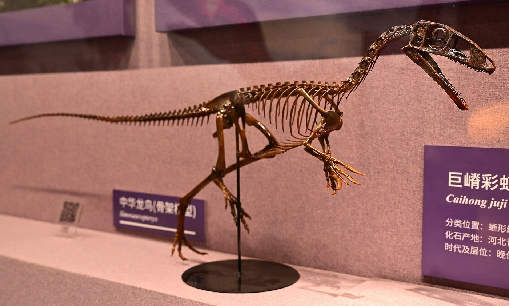
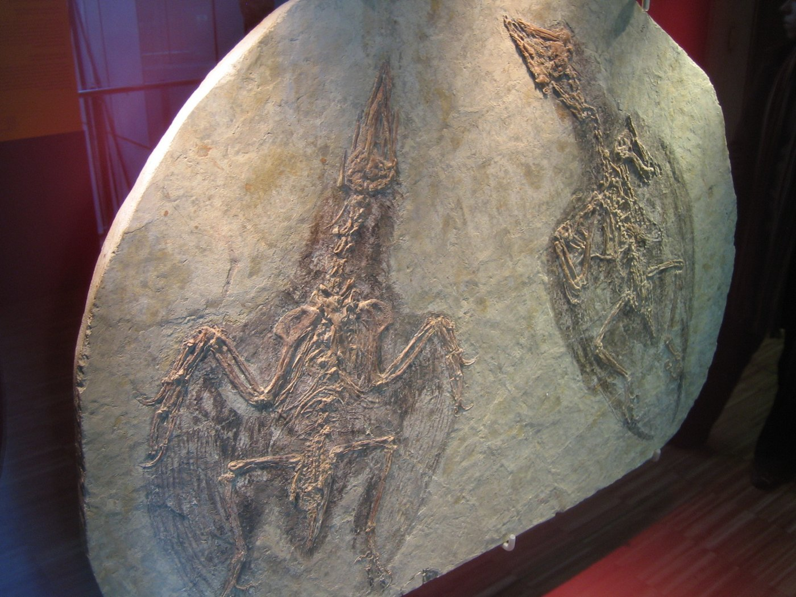
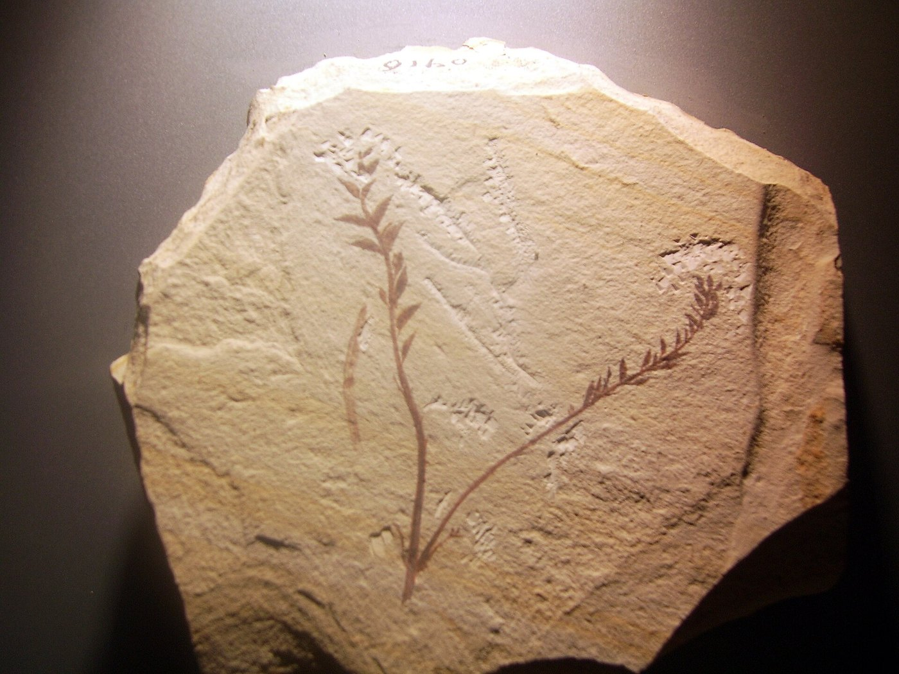
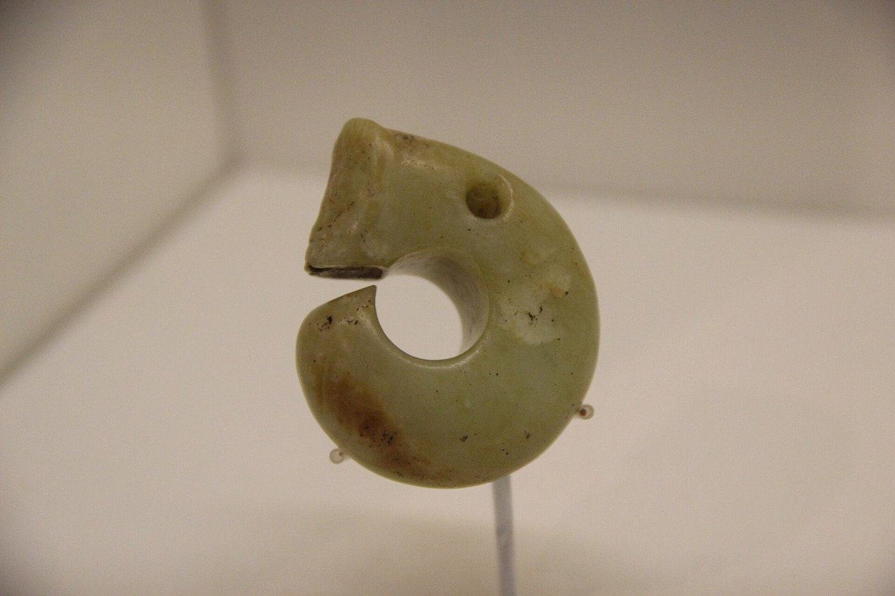
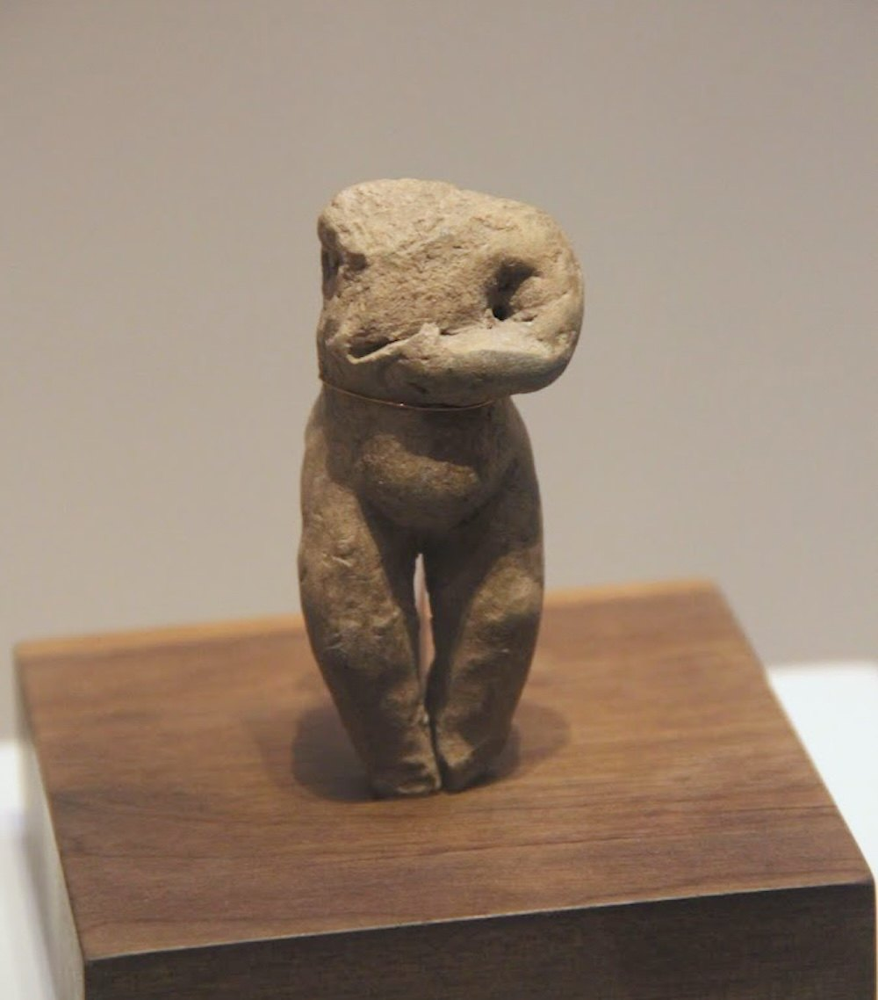

# 02 阶段一·朝阳之前

在人类写下历史以前，这片辽西山地与河谷已经保存了两段长长的记录：一段以亿年计，写在白垩纪的湖相沉积里；一段以千年计，写在大凌河两岸的台地上。这一阶段还没有任何政权能管到这里——决定人在哪里住、吃什么、怎样组织起来的，是地形、气候和生计。它的终点是一次根本变化：这片河谷第一次被编进中原的郡县。

* **1.3 — 1.2 亿年前** 热河生物群
* **前 6200 — 前 5400** 兴隆洼文化
* **前 5000 — 前 3000** 赵宝沟 · 红山 · 牛河梁
* **前 3000 — 前 1000** 小河沿 · 夏家店下层 · 魏营子

## 1.1 热河生物群：被岩层保存的生命世界

_时期：早白垩世_

约 1.3 亿至 1.2 亿年前，辽西地区湖泊密布、火山活动频繁。快速掩埋与细密沉积，使羽毛、皮肤、植物这些通常难以保存的结构留下了痕迹。**所谓热河生物群，并不是某一个地点或某一种动物**，而是一整套以早白垩世陆相生态系统为核心的化石组合——动物、植物、昆虫和湖泊生态共同构成一幅可以被重建的画面。

朝阳的重要性，不在于某一件明星化石，而在于这套组合的完整性。**中华龙鸟**显示部分小型兽脚类恐龙具有丝状羽毛；**孔子鸟**是早期鸟类的重要代表；**辽宁古果**等早期被子植物化石，则让“最早的花”这类叙事有了地层背景。三者拼在一起，正好覆盖了“恐龙—鸟”与“裸子—被子植物”两个关键的演化过渡。

中华龙鸟（Sinosauropteryx）骨架装架，产地为辽西朝阳地区。化石周围的丝状结构，使“恐龙是否长羽毛”从推测变成了可以直接观察的证据 · 摄影：[Wikimedia Commons](https://commons.wikimedia.org/wiki/File:Sinosauropteryx_mount_Chaoyang.jpg)

孔子鸟（Confuciusornis）化石标本：保存了头骨、前肢与羽毛印痕的早期鸟类，是辽西热河生物群的代表性发现之一 · 摄影：[Wikimedia Commons](https://commons.wikimedia.org/wiki/File:Confuciusornis_sanctus.jpg)

辽宁古果（Archaefructus liaoningensis）化石：早期被子植物的代表，让“第一朵花”的说法有了确切的地层出处 · 摄影：[Wikimedia Commons](https://commons.wikimedia.org/wiki/File:Archaefructus_liaoningensis.jpg)


\*\*概念辨析｜“第一只鸟飞起的地方”是文化表达，不是学术结论。\*\*中华龙鸟不是现代意义上的鸟，它属于兽脚类恐龙；孔子鸟才是早期鸟类。两者共同帮助人们理解“恐龙—鸟”演化的复杂过程，但不能把不同类群、不同学术定义混成一句话。阅读化石时，先看它属于哪一类、出自哪一层，再看它被用来讲什么故事。


白垩纪的这套沉积，还给今天留下了一笔意外遗产：正因为岩层如此保存精细，朝阳才成为世界级的古生物研究地点，并在近几十年里持续产出新发现。**化石不是这座城市的背景装饰，而是它最早的一段地层档案。**

## 1.2 从营地到聚落：兴隆洼、赵宝沟与红山

_时期：前 6200 — 前 3000_

进入全新世以后，大凌河流域的河谷与台地成为史前人群长期活动的舞台。约公元前 6200 年至前 5400 年前后（距今约 8150 — 7350 年），**兴隆洼文化**代表辽西较早的定居聚落传统；其后**赵宝沟文化**（约前 5000 — 前 4500）在器物、聚落与精神表达上呈现新的面貌。考古学家用遗址、器物组合和年代来划分“文化”——**这些名称是研究者归纳出来的，不等同于有明确族名的古代民族。**

到**红山文化**（约前 4500 — 前 3000，距今约 6500 — 5000 年）时期，辽西社会的公共礼仪和区域联系显著增强。牛河梁的祭坛、积石冢和女神庙遗址说明，一些大型仪式中心能够动员跨越多个聚落的资源。玉器在这里不是孤立的精美物件，而是身份、仪式与共同观念的载体。

红山文化玉猪龙。这类卷体兽首的玉雕是红山文化最具辨识度的器物，多出于积石冢等礼仪性遗存，说明玉器在当时承担的是身份与仪式功能，而非单纯的装饰 · 摄影：[Wikimedia Commons](https://commons.wikimedia.org/wiki/File:Hongshan_Jade_Dragon_1.jpg)

朝阳所在的辽西地区，正是红山文化的核心分布区之一。这里“古老”的含义有两层：一层以亿年计，是化石记录的生命史；一层以千年计，是文明形成的进程。**两层的证据类型完全不同，不该用一句话概括。**

## 1.3 礼仪中心与玉器：牛河梁说明了什么

_时期：前 3500 — 前 3000_

牛河梁遗址位于凌源与建平交界一带，由祭坛、积石冢群和女神庙等礼仪性遗存构成。它带来的问题不是“当时有什么”，而是“当时能组织起什么”：修一座积石冢要采石、运输、垒砌；维持一个跨聚落的仪式中心，需要有人协调人力、分配物资、确立规则。

礼仪遗存里最值得注意的是人的形象。**红山文化出土的女性陶塑**，以及女神庙中发现的泥塑残件，说明当时的信仰体系里已经有明确的神像塑造。把神像做得像人，意味着宗教想象进入了可以被人群共同观看的形态——这本身就是社会组织能力的一种证据。

红山文化陶塑女性像（1982 年辽宁出土）：形体简练而特征明确。这类陶塑与牛河梁女神庙的泥塑残件一起，说明当时已有成型的神像崇拜 · 摄影：[Wikimedia Commons](https://commons.wikimedia.org/wiki/File:Neolithic_pottery_pregnant_woman,_Hongshan_Culture,_Liaoning,_1982.JPG)


\*\*概念辨析｜“祭坛”不等于“国家”。\*\*能把大量人力集中到一处礼仪工程上，说明社会已经有了超出家庭的组织能力；但从“有公共工程”走到“已经建立国家”，中间还需要社会分层、权力继承、成文制度等方面的证据。玉器和祭坛证明的是共同观念与协作规模，不是王权本身。


## 1.4 青铜时代：农牧之间的接触带

_时期：前 3000 — 前 1000_

红山文化之后，**小河沿文化**（约前 3000 — 前 2500）等阶段继续见证聚落与生活方式的变化。进入**夏家店下层文化**（约前 2000 — 前 1500）时期，石城、聚落防御和农业生产显示社会组织进一步复杂化；约公元前 1300 年至前 1000 年间，可以用**魏营子文化**等辽西青铜文化材料理解过渡；**夏家店上层文化**（约前 1000 — 前 300）则以青铜器、马具和更广泛的草原交流见长。

这里出现了贯穿此后两千年的一个基本格局：**农业地带与北方草原之间并非截然分割**。朝阳所在的辽西，长期承担技术、物资和人群往来的中介角色。青铜器上的草原风格、墓葬中的马具，与同一地区出土的农具和陶器并存——两种生活方式在同一个区域里交错，而不是各占一边。

从公元前 1000 年前后到战国之间，本地可依据的考古材料相对减少，文献则开始留下“山戎”“东胡”这样的名称。这些名称来自中原的记录，指向一个大致方位，**却不能直接与史前考古学文化连线**。可靠的做法是先确认年代和地域，再讨论生产方式、人口移动与文化交流。


\*\*小结｜这一阶段留下了什么。\*\*它不是“朝阳建城之前的空白”，而是三层互相独立的记录：化石记录生命怎样演化，聚落记录人群怎样生活，礼仪遗存记录共同体怎样组织。三层叠在同一片河谷里，但彼此不能互相证明。真正把这片地方带进文字历史的，是下一个阶段——中原的郡县。

