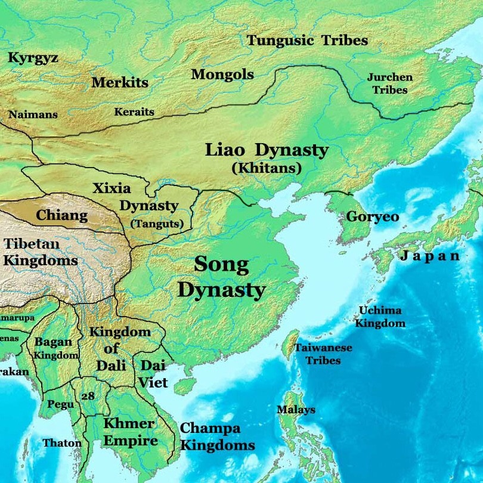
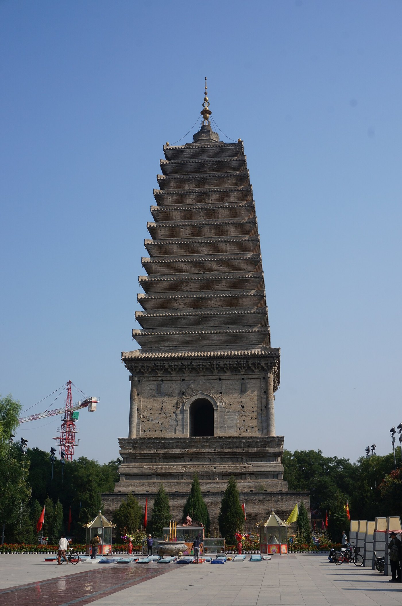

# 06 阶段五·兴中府

今天朝阳最醒目的古迹，几乎都是在这一阶段定型的。契丹建立辽朝后，朝阳地区进入中京道体系：辽初在旧营州地区置霸州，1041 年升为兴中府；金代设兴中州，元代属大宁路。府州体系一路沿用到元末，而北塔、南塔与凤凰山塔寺群，则把一座城的宗教景观固定了下来。这一阶段的转折点是城市性质的改变：它从“帝国边地的前沿”变成了“区域内的行政与宗教中心”。

* **辽初** 置霸州
* **1041** 升兴中府
* **辽 · 重熙** 北塔大修包砌
* **984 / 1076** 南塔石宫题记 · 塔身营建
* **金** 改兴中州
* **元** 属大宁路

## 5.1 从霸州到兴中府：辽代的区域重镇

_时期：10 — 12 世纪_

契丹建立辽朝后，朝阳地区进入其中京道体系。辽初在旧营州地区置**霸州**，1041 年（重熙十年）升为**兴中府**。它沿用旧城的基础，把中京、辽东与燕云地区连接起来；汉人、契丹人与渤海遗民等在府州、村落和寺院周边长期杂居。

辽代崇佛风气浓厚，佛塔兼具供奉舍利、展示功德与标志城市空间的作用。朝阳双塔南北相望，凤凰山亦分布塔寺，形成了今天理解“佛塔之城”的历史基础。辽代朝阳的重要性，不只是接近契丹早期的活动区域，更在于它正好位于农耕城镇、草原通道和中京交通之间。

1025 年前后的东亚：辽（契丹）疆域覆盖今日内蒙古中南部与辽宁西部，南为宋、西南为西夏。朝阳一带正在辽的中京道范围之内——这也是“朝阳不在宋朝管辖之下”的地图依据 · 图：[Wikimedia Commons](https://commons.wikimedia.org/wiki/File:Liao_Dynasty_in_1025.jpeg)

## 5.2 北塔：五世叠压与五十六万块砖

_时期：4 — 11 世纪_

北塔位于今慕容街北端。考古与维修揭示，它的塔基之下叠压着三燕宫殿台基、北魏思燕佛图、隋代舍利塔、唐代维修层，最外面才是辽代包砌的塔体。所谓\*\*“五世同堂”\*\*，指的是同一个建筑地点跨越多个时代的连续使用与改造——**这不是五座塔排在一起，而是一个位置被反复重建了五次。**

| 时期       | 年代            | 遗存与事件             |
| -------- | ------------- | ----------------- |
| 第五世 · 辽  | 重熙十二 — 十三年（1043—1044） | 延昌寺塔大修包砌；形成现存主体。  |
| 第四世 · 唐  | 天宝年间          | 维修隋塔，开元寺传统。       |
| 第三世 · 隋  | 602 年前后       | 舍利塔建设；寺名资料存在不同口径。 |
| 第二世 · 北魏 | 485—490 年前后   | 旧宫基上建思燕佛图，后毁于火。   |
| 第一世 · 三燕 | 4 — 5 世纪      | 和龙宫大型宫殿夯土台基。      |

从上往下读，是今天看到的塔向地下追溯；从下往上读，则是一处宫殿台基不断被后世宗教建筑继承的过程。辽重熙年间的大规模包砌和维修，形成今天所见的密檐式砖塔主体；天宫、地宫出土的舍利容器和大量佛教文物，使北塔不仅是地面建筑，也是研究辽代佛教、工艺和舍利制度的重要考古现场。


\*\*科普｜什么是密檐式砖塔。\*\*密檐式塔把多层屋檐紧密叠置，塔身第一层通常较高，上部各层间距很短。\*\*远看层数很多，但多数层并不是可以供人登临的楼层。\*\*砖砌的斗拱、门窗、佛像和飞天，则兼具结构模拟与宗教装饰的作用。



\*\*科普｜塔的“天宫”和“地宫”在哪里。\*\*地宫通常设在塔基之下，天宫则位于塔身较高处或刹座附近，两者都可以安置舍利、经卷、造像和供养器。名称里的“宫”是宗教建筑术语，并非帝王居住的宫殿——它们像被封存起来的时间胶囊，为断代和理解信仰仪式提供证据。



**数字｜五十六万二千余块砖包住旧塔。辽代这次大修不是简单补缝，而是以五十六万二千四百七十三块砖**进行大规模包砌。工匠把前代塔体整体纳入新结构，才形成今天所见的外观。北塔因此像一部没有拆掉旧页、而是在旧页外面继续装订的建筑史。


## 5.3 南塔与凤凰山：双塔构成的轴线

_时期：辽 — 金_

南塔位于慕容街南端，与北塔南北呼应，为方形密檐式砖塔。塔基石宫题记关联辽\*\*统和二年（984）**的锭光佛舍利供奉，现存塔身通常联系到辽**大康二年（1076）\*\*前后的营建，金代又有维修。2004 年前后施工时发现了塔基石宫及成套舍利器物；关于舍利数量，通俗资料曾出现不同说法，阅读时宜以正式发掘记录和铭文释读为准。

朝阳南塔。与北塔复杂的包叠不同，南塔更适合用来观察一座辽代密檐砖塔的整体形制：方形塔身、逐层收分的密檐、顶部的塔刹 · 摄影：[Wikimedia Commons](https://commons.wikimedia.org/wiki/File:Southern_Chaoyang_Pagoda_03_2015-09.JPG)

**凤凰山**古名龙山。前燕龙翔佛寺遗址把山地佛教史追溯到三燕时期；辽代又在山中大规模营建。摩云塔位于云接寺一带，为方形密檐砖塔；现存寺院建筑多属后世重建，北沟大宝塔则呈现山野孤塔的风貌。延寿寺等寺院经历多次兴废与重修。**今天游览凤凰山，要先把“古代遗址”“现存辽塔”“清代或现代重建寺院”区分开，才能准确理解所见建筑的年代层次。**


\*\*概念辨析｜双塔并不构成一座对称的寺院。\*\*北塔和南塔今天隔街相望，容易让人以为它们原本属于同一座对称布局的寺院。实际上，两塔的营建过程、地下遗存和附属寺院并不相同：北塔最突出的是跨越三燕至辽代的五世叠压，南塔则更集中体现辽代塔体与石宫舍利的发现。


古代城市借塔来标识佛寺、街道和天际线；后世寺院消失之后，孤塔仍然会成为城市方向感的核心。地方上长期称这里为\*\*“三座塔”\*\*，正说明古塔不仅是宗教建筑，也一直参与着居民对城市空间的记忆。

## 5.4 金元承接：兴中州与大宁路

_时期：12 — 14 世纪_

金朝继承辽地，朝阳地区属**北京路大定府**体系，设**兴中州**等建置，南塔等建筑留下金代修缮的痕迹。元代兴中州隶属**大宁路**，城市和交通节点继续使用，女真、蒙古、汉人及其他人群在辽西往来。


\*\*概念辨析｜“府、州、路”是不同王朝的行政层级，不能混用。\*\*辽代的最高层级是府（兴中府），金代改为州（兴中州），元代则归入路（大宁路）。所以不能简单写成“金代兴中路”或“元代仍以兴中府为最高层级”——**名称的变化恰好反映的是统治体系的重组，而不是同一件事换了三次说法。**

