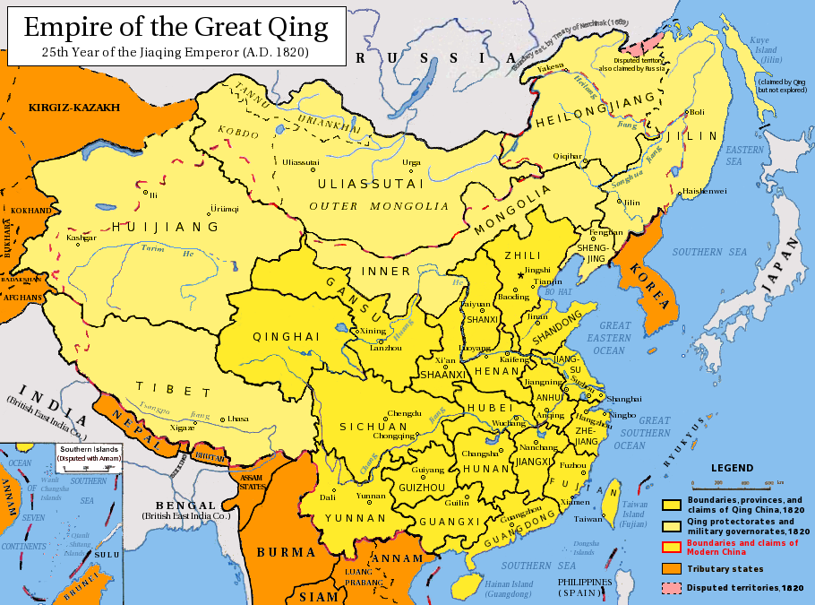
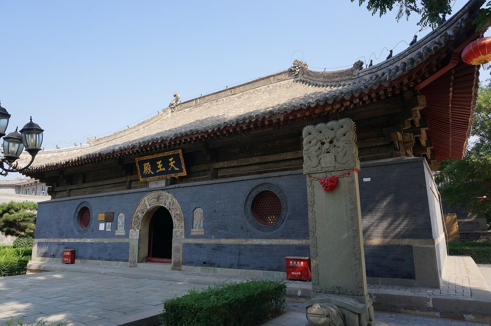

# 08 阶段七·清代设治

清代把这片地方重新拉了回来——正好与明代相反。清初，这里主要属土默特左右翼旗及卓索图盟范围，处于柳条边以西北的蒙古旗地环境中；十八、十九世纪的人口压力与边地开发，让获准垦殖、租佃和越边迁入并行，汉人数量增加，形成更大规模的汉蒙交往。1698 年佑顺寺开工，1778 年设朝阳县，1904 年升朝阳府——“朝阳”这个名字与今天的城市空间就此定型。进入民国，归属又几度变更：1914 年划入热河特别区，1928 年属热河省，直到 1955 年热河省撤销才划归辽宁省。此后，考古发掘又让地下的城址和史前的文明重新进入公共视野。

* **清初** 土默特旗地 · 卓索图盟
* **1698 — 1707** 佑顺寺营建并赐名
* **1774** 置三座塔厅
* **1778** 设朝阳县（隶承德府）
* **1904** 升朝阳府
* **1914 — 1955** 属热河
* **1955 以后** 属辽宁省
* **近现代** 考古发掘与遗址保护

## 7.1 旗地、垦殖与汉蒙交往

_时期：17 — 19 世纪_

清初，朝阳地区主要属**土默特左、右翼旗**及**卓索图盟**的范围。它位于柳条边以西北的蒙古旗地环境中，人口流动和土地开垦受到制度约束；随着十八、十九世纪的人口压力和边地开发，获准垦殖、租佃及越边迁入并行，汉人数量增加，形成了更大规模的汉蒙交往。

要理解这段历史，需要先分清清代蒙古的两套不同安排：**外藩蒙古**设世袭的扎萨克，编入盟；**内属蒙古**则由朝廷任命总管管理，不设盟。卓索图盟属于前者；而同一区域内的管理还牵涉到旗与府县两套系统并行运作。**“旗地”与“县治”不是先后接替，而是长期并存。**

卓索图盟的构成值得记一下：它是喀喇沁左、中、右三旗与土默特左、右翼二旗共五旗的会盟组织，会盟地“卓索图”就在土默特右翼旗境内、约当今天的北票一带——**也就是说，这个盟的会盟地本身就落在今天朝阳的范围里**。这套旗分一直延续到民国：1914 年随热河特别区脱离直隶省，1933 年以后盟制名存实亡。影响至今的直接遗留，是朝阳市辖内仍有**喀喇沁左翼蒙古族自治县**——1635 年编定的喀喇沁左翼旗[^kalaqin]，1957 年撤旗，1958 年改设自治县。

1820 年的清朝。设于 1778 年的朝阳县当时隶直隶省承德府，正处在直隶与内蒙古盟旗交界的地带——这也是“旗地与县治长期并存”的空间背景 · 图：[Wikimedia Commons](https://commons.wikimedia.org/wiki/File:Qing_dynasty_1820.png)

## 7.2 佑顺寺与设治：1698 / 1778 / 1904

_时期：清 — 民国_

**佑顺寺**于康熙三十七年（1698）开工，康熙四十六年（1707）竣工，并由康熙帝赐名“佑顺”，是辽西重要的藏传佛教寺院。它的建筑群位于南塔附近，却与辽代双塔相隔六百余年——**空间很近，年代很远，这正是朝阳“水平并置”的典型。**

佑顺寺。它坐落于南塔附近，与辽代双塔同处一条城市轴线，年代却相隔六百余年。看这一带时，先分年代再看空间，才不会被相邻的位置误导 · 摄影：[Wikimedia Commons](https://commons.wikimedia.org/wiki/File:Youshun_Temple_22_2015-09.JPG)

设治不是一步到位，而是分四步走。



### 乾隆三年（1738）

清廷在凌源设塔子沟厅，这一带是其东境。



### 乾隆三十九年（1774）

析塔子沟厅东境置**三座塔厅**，治所就在今天的朝阳市区——“三座塔”这个俗称，一度真的成了政区名。



### 乾隆四十三年（1778）

撤三座塔厅改设**朝阳县**，隶直隶省承德府。



### 光绪三十年（1904）

升朝阳县为**朝阳府**，初领建昌、建平、阜新三县；宣统元年（1909）又增置绥东县，共领四县。



近现代的行政地名和治理中心由此逐步稳定。也就是说，今天人们说的“朝阳”这个名字，作为正式行政名称其实只有两百多年——它比城里的塔年轻得多。

政区的转折并没有停在 1904 年。**民国二年（1913）废朝阳府存朝阳县**，县先隶直隶省；第二年，**1914 年设热河特别区**，脱离直隶省，朝阳县随之划入；**1928 年改设热河省**，朝阳县属热河省，省会承德。此后这里经历 1933 年的沦陷与 1945 年后的恢复，直到**1955 年 7 月热河省撤销**——朝阳与北票、建平、建昌、凌源四县及喀喇沁左旗一并划归辽宁省，由锦州专员公署领导。又过几年设朝阳专区，1984 年改设省辖朝阳市。**所以“朝阳归辽宁”，到今天才七十来年；而此前四十一年，它在热河。**

## 7.3 “三座塔”为什么只剩两座

_时期：地名记忆_

在后世的地名记忆里，朝阳城曾以\*\*“三座塔”\*\*著称。东塔于清乾隆七年（1742）倾塌，乾隆九年（1744）在其塔基旁建关帝庙以补三塔鼎峙之形；今天城市中心最醒目的是北塔与南塔。消失的东塔虽然不再可见，却仍通过地名和地方叙事参与塑造着城市身份。

这件事也提醒读者：\*\*今天看到的城市景观，是层层筛选之后的结果。\*\*哪些建筑留下来、哪些消失了，取决于火灾、战争、维修能力和后来的保护决策。把现状当成“自古以来就是这三座塔”或“一直是这两座塔”，都会漏掉中间那些被删掉的部分。

## 7.4 从发现到保护：考古怎样改写城市记忆

_时期：近现代_

近现代的调查、发掘和古建筑维修，使三燕龙城、北塔地宫天宫、南塔石宫、牛河梁和热河生物群等材料先后进入公共视野。朝阳的城市身份，也由“古塔可见”扩展为\*\*“地下城址、史前文明与生命化石共同可读”\*\*。

保护并不是把遗址冻结起来。考古研究会修正旧认识，展示方式也会更新；今天对一处遗址的理解，可能和三十年前完全不同。**读者最重要的阅读方法，是区分原址、原物、复建与叙事，并尊重遗址的脆弱性。**

> \*\*小结｜朝阳何以成为朝阳。\*\*在朝阳，亿万年的生命史、五千余年的文明史与两千余年的城市史叠在同一片土地上。它既不是单线发展的“古都传奇”，也不是若干景点的拼盘。它的独特性正来自反复的连接：农耕与草原、中原与东北、王朝政治与宗教信仰、地上古塔与地下城址。

> **四把钥匙｜读这段历史的四个抓手。用叠压**理解北塔下的宫殿、木塔、砖塔与包砌层；用**并置**理解同一片区里相距数百年的建筑为何彼此相邻。这两者回答的是“物质遗存怎样层积”。用**通道**理解柳城、龙城、营州和兴中府为什么反复成为区域中心——交通带来繁荣，也带来战争与迁徙，这是位置的后果。再用**尺度**区分亿年的化石史、千年的史前文化与百年的王朝事件，用**证据**让地层、器物、碑刻、文献与现存建筑互相校验：任何一条结论，都要说清它是从哪一类材料里得出来的。

一条主干是清楚的：同一片河谷，被不同的外部世界反复安排。史前由地形与生计决定；此后依次被燕汉的边郡、慕容的都城、唐的营州、辽金的府州、明的卫所与蒙古旗地、清的朝阳县与朝阳府组织进不同的体系。归属改写了七次，居民的生活却总在河谷里延续——种地、放牧、做工、经商、信佛、迁居。朝阳从来不是某个王朝的注脚，而是一直在回答同一个问题：在这条河谷和这点水土之上，怎样安排人的生活。

[^kalaqin]: 喀喇沁左翼旗的编定年份有两种系年。一说天聪九年（1635）后金将喀喇沁部编为左、右两翼旗（《清史稿》等作天聪八年，1634）；一说崇德元年（1636）固鲁思奇布受封固山贝子、扎萨克旗制度正式确立，《蒙古回部王公表传》即以该年为喀喇沁扎萨克旗建立之始。本书取 1635 年，指编旗立制之年，而非扎萨克旗制正式确立之年。
