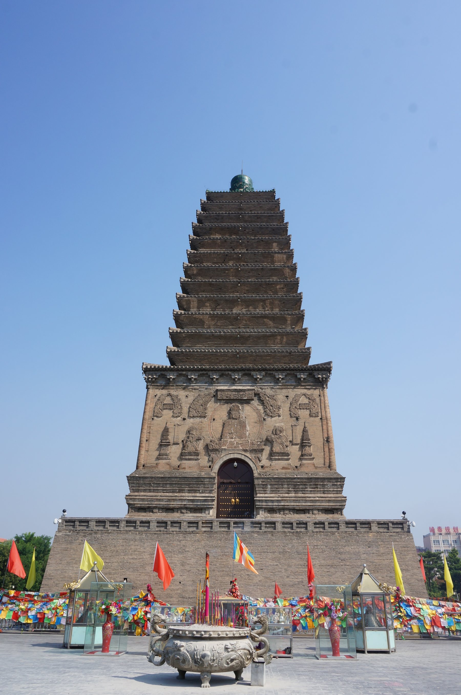

# 00 读懂朝阳历史

大凌河谷、古塔与边地 —— 七大历史阶段

> 朝阳最特别的地方，不是哪一座王朝在这里留下的遗迹，而是**同一个位置被七种秩序先后接管**：没有建制的礼仪中心 → 中原的边郡 → 本地政权的都城 → 帝国的东北门户 → 契丹的府州 → 边墙之外 → 重新设治。**大凌河谷的地理几乎没变，一直改写的，是“这地方归谁、由谁管”。**

朝阳的历史横跨三个量级：生命史以亿年计，文明史以千年计，城市史以两千年计。一亿三千万年前的湖泊沉积保存下羽毛与花朵；五千年前的河谷台地出现了需要动员跨聚落人力的礼仪中心；战国燕的郡县与长城第一次把它纳入中原行政；四至五世纪，它自己做了一百多年的都城；此后是唐代的营州、辽代的兴中府、明代的边外、清代的朝阳县与朝阳府。这本读本按七个阶段重排，每一段只回答同一个问题——这片河谷归谁、由谁管、靠什么活着。

约 1.3 亿年前 — 至今 ｜ 七大阶段 · 三十个主题 ｜ 中国史 · 辽宁地方专题

题图：朝阳北塔（辽代包砌的密檐式砖塔，其下叠压三燕宫殿台基与北魏、隋、唐历代塔体） · 摄影：[猫猫的日记本](https://commons.wikimedia.org/wiki/File:Northern_Chaoyang_Pagoda_04_2015-09.JPG) · [CC BY-SA 4.0](https://creativecommons.org/licenses/by-sa/4.0/)

## 三个“朝阳”：河谷的、名字的、建置的

**地理的朝阳**：辽西山地与大凌河谷相接的一片地方。北面是内蒙古的沙地与草原，南面出渤海，西面经燕山山口通华北，东面沿河谷下到辽东湾。它同时是化石的保存地、史前礼仪的中心区，也是中原与东北之间几乎是唯一好走的一条走廊。

**名字的朝阳**：这个名字不是自古如此。它由清代乾隆年间所设的朝阳县而来；在此之前，同一片地方先后叫过柳城、龙城、营州、兴中府，民间还长期称“三座塔”。名字换来换去，地点却始终在大凌河中游。

**建置的朝阳**：今天朝阳市、县、区的边界，与古代的郡、州、府、卫所辖境都不重合。同一个时期，这一带可能分属不同单位；同一个行政中心，也会在旧城与新治之间转移。把“朝阳市”当成一条自古连续、边界不变的行政实体，是理解本地历史最常见的绊脚石。

## 一条时间轴看全史

* **1.3 亿年前** 热河生物群
* **前 6200 — 前 5400** 兴隆洼定居
* **前 4500 — 前 3000** 红山文化
* **前 3500 — 前 3000** 牛河梁礼仪中心
* **前 1000** 夏家店上层
* **前 300 前后** 秦开却胡 · 燕设五郡
* **前 2 世纪** 乌桓内迁
* **207** 白狼山之战
* **294** 慕容廆经营辽西
* **341** 营建龙城 · 342 迁都
* **436** 北魏取龙城
* **唐** 营州 · 平卢节度使
* **696** 营州事件
* **698 前后** 大祚荣集团建立政权 · 后号渤海
* **1041** 霸州升兴中府
* **辽 · 重熙** 北塔包砌定型
* **1403** 大宁都司徙治保定
* **15 — 17 世纪** 蒙古诸部牧地
* **1698** 佑顺寺开工
* **1774** 置三座塔厅
* **1778** 设朝阳县
* **1904** 升朝阳府
* **近现代** 考古与保护
