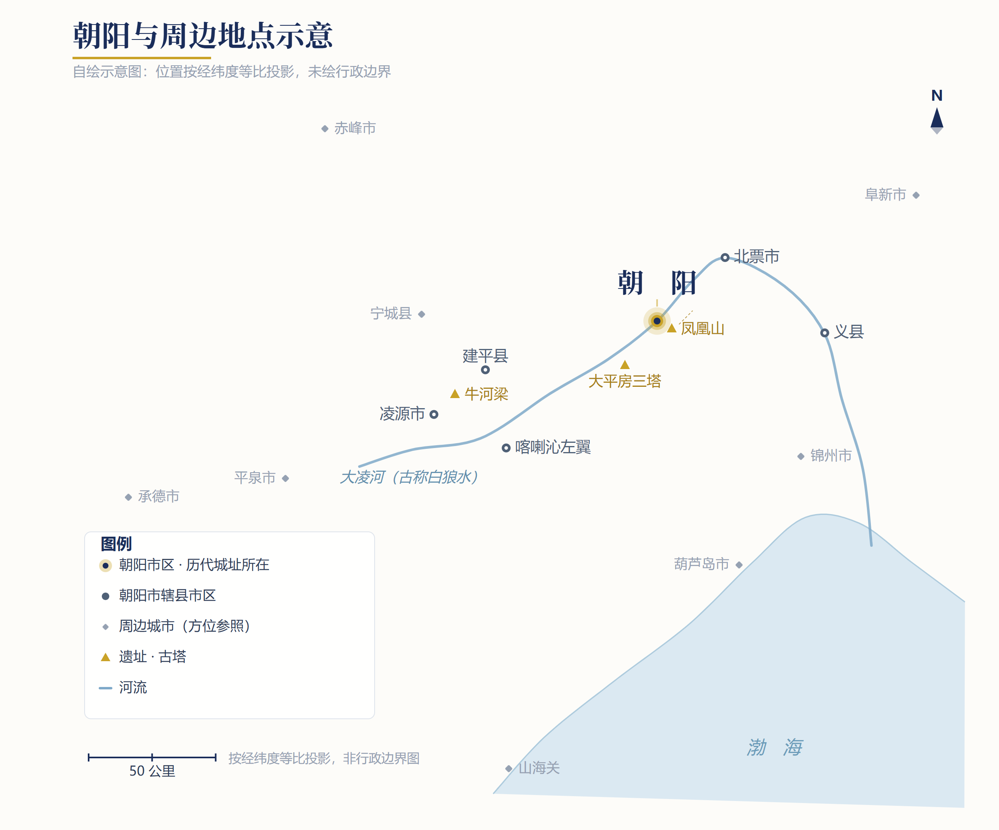

# 引言

**柳城 → 龙城（和龙）→ 营州 → 兴中府 → 朝阳。** 五个名字，落在同一条大凌河上；它们并不总是同一座城，却始终指着同一个地方。

朝阳最广为人知的两张名片，是**三燕古都**与**辽塔圣地**：一个在地下，一个在地上；一个讲政权与族群，一个讲信仰与工艺。四至五世纪，前燕、后燕、北燕先后以龙城（今朝阳）为都城或陪都——三者国号都取“燕”，后世合称“三燕”；龙城也是中国古代唯一以“龙”命名的都城。辽代先在此置霸州，1041 年升为兴中府，为辽代区域佛教中心之一，境内现存辽塔约十四座，“辽塔圣地”之名由此而来。

再往下，是更厚的时间。一亿多年前，辽西的湖泊与火山灰把羽毛恐龙、早期鸟类和最早的花一并封存，朝阳因此被称为“**第一只鸟飞起的地方，第一朵花开放的地方**”；五千多年前，红山文化又在这里留下牛河梁那样的大型礼仪中心。**亿年的生命史、五千余年的文明史、两千余年的城市史，叠在同一片土地上**——这正是朝阳最难得的地方。

<figure></figure>

这本小册子以朝阳历史地名为索引，串联起朝阳的历史、文明与城市史。它想回答的不是“哪一段最辉煌”，而是一个更难的问题：王朝换过，族名换过，城名也换过，这片河谷为什么始终被人选中？线索就藏在名字背后——这里是生态的保存地，是文化的交汇处，也是东北的交通节点。
